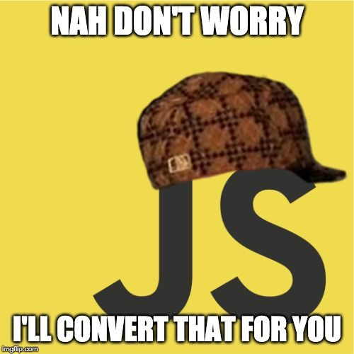

## First Impressions
I must say, I am taken a bit by surprise. I have always thought of javascritp as simply very short lines of code you add to your HTML tags to make stuff move around. To learn it can be a language that stands on its own and is this powerful just filled my mind with crazy ideas. I first learned c++, then self taught Python, which I loved for its loseness, javascript takes this to a new level entirely. I like how majority of the syntax and ideology I am used to in Python also applies in Javascript, and more. Although I must say, the first thing i miss already is Python lists and all the cool list comprehension shortcuts.   

## Style of the class
I am really getting to enjoy this class, because of it I research and read broader in software engineering already. The style of teaching forces the student to build up a certain level of confidence in figuring things that are a chain of steps without being overwhelmed or intimidated. I think the WODs (atleast the first one), was easier than I expected, i had this build up of pressure before starting  but eventually was able to calm myself down and think the code through well before I even wrote a single line. This stresses the importance of good planning in keeping to deadlines as you eventually spend less time rewritting code and debugging when you plan well. 

