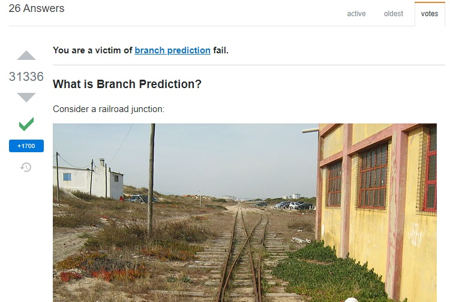
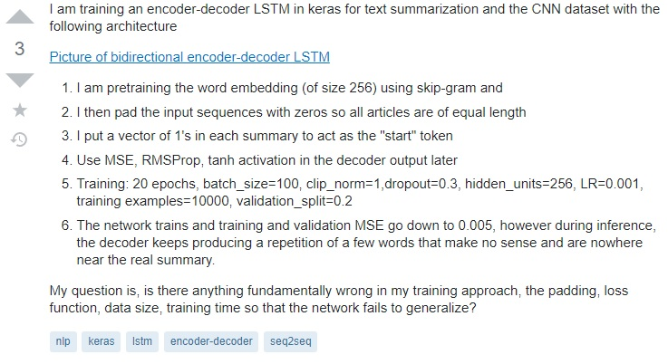

 
# HACC-HUI:
HACC-HUI is the Annual Hawaii Code Challenge (HACC), presented as a team hackathon to principally solve problems in the Hawaiian islands, and is open to any developer ranging from high school to industry  professionals.

Typically, over 200 participants attend the initial meeting, making it hard for participants to know each other and their rtespective skill-sets. Despite other teams,(mostly same location/college students) forming familiar teams, there is still a large number of participants that join without teams and need a more stream-lined way to discover and join teams. This Problem can be solved by crreating a more formalized machenism for joining the competition and discovering teams with complementary skills. Once a team is formed, team members are free to pick who enters their team, team members are also free to exit a team at any point in the competition life-time. Welcome to the HACC 

---
 
The HACC-HUI platform this fall was designed to be mobile first, this means since most users surf the net of their mobile devices, the application should feel closer to a mobile app than it does a traditional desktop website. This changes a lot on how we develop the application using React, meteor,  and semantic UI as opposed to android studio as traditional mobile applications are made. The application also includes a Slack functionality to allow teams the ability to directy affect the Slack functionality view the application when a new member requests access, joins or leaves the teams via the HACC user application interface.
 

While all teams( of 4/5) in the ICS414 class contributed to the same development milestones, the issues were split within the teams. I was Primarily focused on getting the best UI we can make for the application. When a user 

one of this calibre: 

---
 
This question demonstrates a hierachical search about the problem, including their own effort in solving the problem. The poster goes on to demonstrate they are aware there might not be any readily available information to answer their question, and they are willing to explore any positive suggestions. this kind of question is good for the open source community as it provides the next user with things that did not work , and so reduces the search space for the optimal solution to a problem. It also helps expert who would have perhaps not encountered this kind of problem before (and maybe never), be able to guide their juniors in the workplace or research when they encounter the problem. 

This question was worthy, and so it received multiple solutions, some with better time and space complexity than others, generally a good question and thread. 

---
 
# Bad questions:
Bad questions will almost always lead to bad answers(if you are lucky) or none at all. Bad questions always sound and feel like good questions to the uninitiated, they are short, to the point and and with a question mark "?". The initiated can always spot these questions and never confuse them for good questions, infact, an uninitiated friend says they pray on these when they are annoyed.  

 
The question in the picture above shows that the poster is only concerned about his specific problem running on his laptop at that point in time and did not do any extensive research on the matter, _probably because he also didnt allocate enough time for the task so he has no time_. This question lacks the depth of the knowledge in the software tools while at the same time asking a very specific question, this clearly indicates the person did not first read on documentation and theoretical backing of the algorithms in hand and expects others to just hand him/her the solution.

---
 
This question received only one response that is also perplexed by poster's approach and eventually points the poster to some of the resources he/she did not expore before asking what he should have. 
 
In conclusion, do you have any good questions for me?
