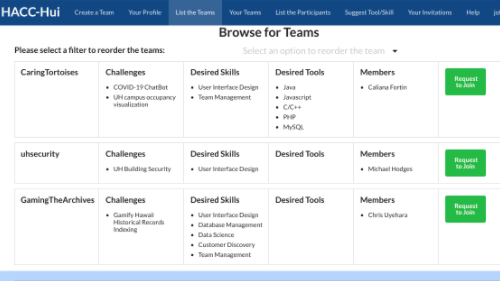

 
# HACC-HUI:
HACC-HUI is the Annual Hawaii Code Challenge (HACC), presented as a team hackathon to principally solve problems in the Hawaiian islands, and is open to any developer ranging from high school to industry  professionals.

Typically, over 200 participants attend the initial meeting, making it hard for participants to know each other and their rtespective skill-sets. Despite other teams,(mostly same location/college students) forming familiar teams, there is still a large number of participants that join without teams and need a more stream-lined way to discover and join teams. This Problem can be solved by crreating a more formalized machenism for joining the competition and discovering teams with complementary skills. Once a team is formed, team members are free to pick who enters their team, team members are also free to exit a team at any point in the competition life-time. Welcome to the HACC 

---
 
The HACC-HUI platform this fall was designed to be mobile first, this means since most users surf the net of their mobile devices, the application should feel closer to a mobile app than it does a traditional desktop website. This changes a lot on how we develop the application using React, meteor,  and semantic UI as opposed to android studio as traditional mobile applications are made. The application also includes a Slack functionality to allow teams the ability to directy affect the Slack functionality view the application when a new member requests access, joins or leaves the teams via the HACC user application interface.
 

While all teams( of 4/5) in the ICS414 class contributed to the same development milestones, the issues were split within the teams. I was Primarily focused on getting the best UI we can make for the application. When a user first accesses the site, they need to create a profile and enter their skills and preferences. After this, The user is able to see the different challenges and teams, at which point they are able to request to join a team. The existing team members then have a chance to see his/her expertise and decide to let them in or reject. Initiall I worked on both the UI and backend functionality for listing existing teams and allowing for sorting the list according to a certain attribute. While I had done something like this before in ICS314, the size of the HACC-HUI code base alone made it feel very different, also the data model was much more advanced and had enhanced security features. Ath the end it was a steep learning curve but certainly fulfilling by the time I had the functionality working.
 

My second biggest contribution was the design and implementation of a "Create profile" page. Once a user signs up and logs in, they are directed to this page to complete their profile, entering information such as skillset and education. This time I only worked on the form and its aesthetics, while another member of my team made sure the form and schema behind it tie up to the collection in the database.
 

As in ICS314, We worked in groups of four, my other team members being Bryson Yuen, Kason Shiroma, and Matthew Kim. Our team worked entirely online due to the pandemic, and so all team meetings were conducted on either zoom or Discord. Most team meetings were held right after class, and we would go over the new milestone and issues, discussing how each would be approached and assessing the level of dificulty. Matthew Kim assumed the role of mediator in most meetings and this really helped us stay on track. At the end of our meetings, everyone would know exactly what issues they are working on and how the issues depend on each other so we get the timing right. While we did not always manage to finish all the issues in each milestone, the race against time was thrilling and forced us to think outside the box interms of reusing concepts we had come across in ICS314. This really drove home the idea that if you write good, modular code once, it can go a long way in the future.

# Thoughts About ICS414:

