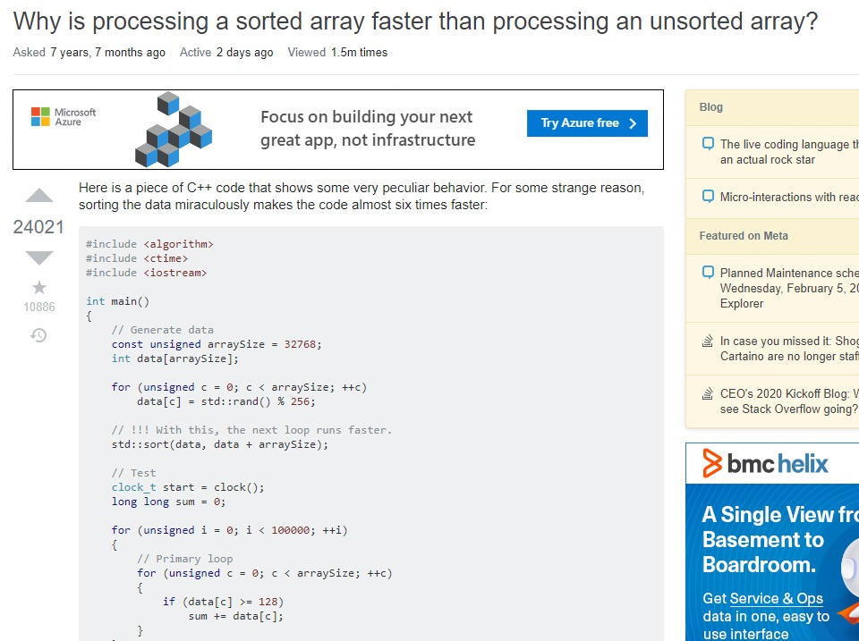

# Questions:
A question, besides the clear "?" sign, is characterized by certain relative words such as _who, where, why, what_, that ignite dialogue, isn't it? In different domains of knowledge, people ask a plethora of questions in different ways, __"whosoever asks the right question, if he be worthy, shall posses the power of knowledge"__. 

 
In software engineering, an efficient developer will most certainly find himself stuck at some point, and will need to seek help with others instead of wasting time trying to ego-solve an engineering problem. Open source developer communities have become the go to place for such question due to a number of reasons ranging from the large community of skilled programmers to the fact that help is entirely free of charge(monetory). With that said, you need to realize whenever your ask a question that you are asking a highly skilled and occupied individual, to take time to address your specific issue, and so to be worthy of an answer, you better make your question worth his attention. Good questions normally attract the . Whats a worthy question you may ask? 

one of this calibre: 

---
 
This question demonstrates a hierachical search about the problem, includding their own effort in solving the problem. The poster goes on to demonstrate they are aware there might not be any readily available information to answer their question, and they are willing to explore any positive suggestions. this kind of question is good for the open source community as it provides the next user with things that did not work , and so reduces the search space for the optimal solution to a problem. It also helps expert who would have perhaps not encountered this kind of problem before (and maybe never), be able to guide their juniors in the workplace or research when they encounter the problem. 

This question was worthy, and so it received multiple solutions, some with better time and space complexity than others, generally a good question and thread. 

---
 
# Bad questions:
Bad questions will almost always lead to bad answers(if you are lucky) or none at all. Bad questions always sound and feel like good questions to the uninitiated, they are short, to the point and and with a question mark "?". The initiated can always spot these questions and never confuse them for good questions, infact, an uninitiated friend says they pray on these when they are annoyed.  

 
The question in the picture above shows that the poster is only concerned about his specific problem running on his laptop at that point in time and did not do any extensive research on the matter, _probably because he also didnt allocate enough time for the task so he has no time_. This question lacks the depth of the knowledge in the software tools while at the same time asking a very specific question, this clearly indicates the person did not first read on documentation and theoretical backing of the algorithms in hand and expects others to just hand him/her the solution.

---
 
This question received only one response that is also perplexed by poster's approach and eventually points the poster to some of the resources he/she did not expore before asking what he should have. 
 
In conclusion, do you have any good questions for me?
