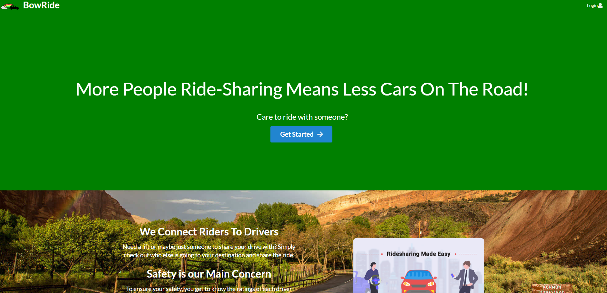

__Bowride__

[<i class="large car green icon"></i>Running Application](http://bowride.meteorapp.com/#/) 
[<i class="large github icon"></i>Project Home Page](https://github.com/bowride/bowride.github.io) 

The purpose of this project was to work as a team to implement a medium scale  web application using the software stack (semantic-ui, react, meteor) covered in ICS 314. Another key requirement was that such a project should be a potential solution to a problem in the UH manoa student community. The problem we tackled was that sometimes students feel unsafe or uncomfortable riding uber or lyft with drivers they see for the first time and may never see again.

Our solution was to create a web application that will allow students with cars to post an offer to drive, and a student with the same intended destination can opt to ride with the offering student. As registration is only restricted to UH email addresses, this ensures student ride with other student or faculty only, reinforcing safety and comfort. The other added benefit is that this creates an extra channel for students to forge long lasting friends within the UH community.

During development, all team members picked what component of the project they want to work on. Our main communication tool was Slack because you can have it on the phone as well for urgency. My main contributions to the project were designing and implementing the front-end. I also implemented the back-end collections for the driver  information we collect and display as a card to potential riders. In the final days of the project. I also implemented the admin  dashboard for the app  although this was never furnished to my liking. using some tricks I  implemented a driver search filter that allows rider students to filter drivers by destination, car type and number of seats available. 

Of all the features worked on in the project, I am proudest about the UI we ended up with for most of the pages, in particular the landing page.

The importance of communication in team projects became undeniably clear very early, even with GitHub assisting in  tracking of changes made by the team, we still found ourselves  with messy merge conflicts every now and then. I found it is vital for a team to have and formalize its soure control mandate. matters around commits, branch merges, how long can branches be before merging, what issues deserve a branch, and whether its ever okay to commit directly to master? (Don't!). I also found that it was a big mistake that we never drew down our data model for the entire application and made sure we are all on the same page as to how everything connects. Such doubts hurt you later as you have to restructure earlier collections to accommodate new features.

Overall, this was a great experience and I'd recomment the class to any computer science major. I will surely be building more web apps in react and meteor. Not only am I a better web developer now than I was before, but also think about and implement all software better as a computer science student. 

