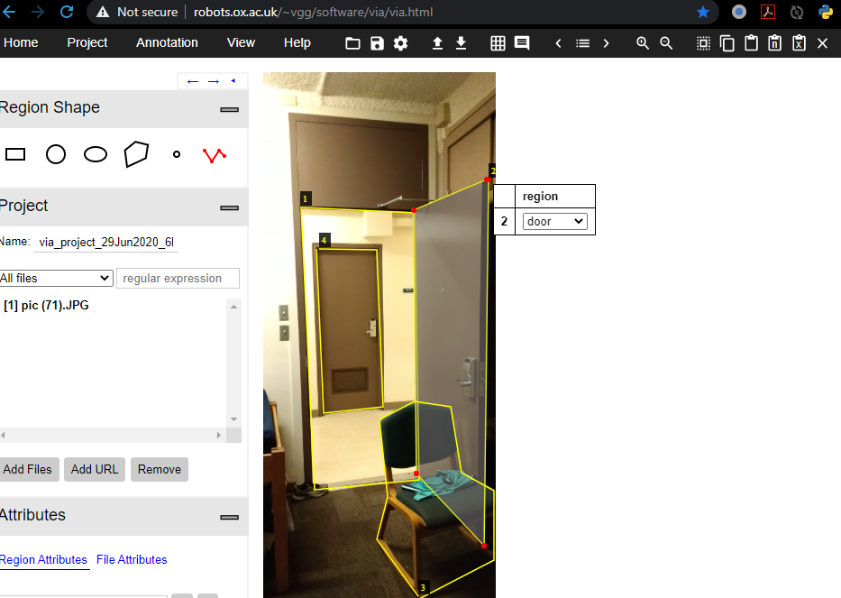

[<i class="large chrome icon"></i>Website:](https://mblesse.com) 

### Credit
* Most of the detectron training setup is from the official documentation and [examples](https://github.com/facebookresearch/detectron2/tree/master/projects) on detectron2's [git repo](https://github.com/facebookresearch/detectron2)

* Video IO from Satya mallick's [learnopencv](https://www.learnopencv.com/read-write-and-display-a-video-using-opencv-cpp-python/)

-----
