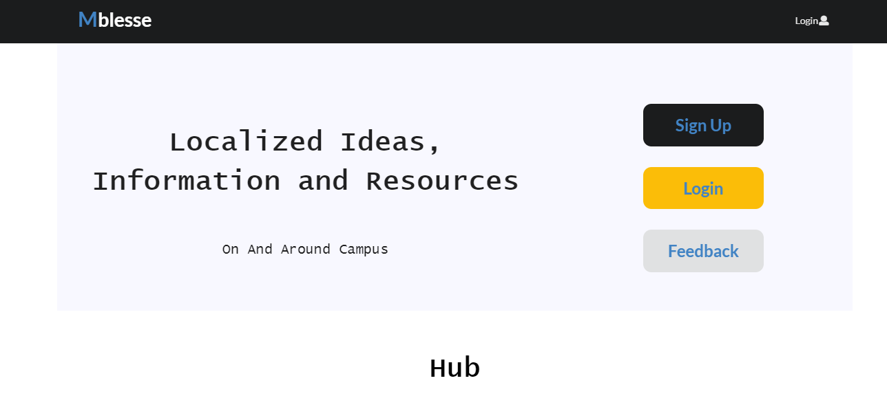
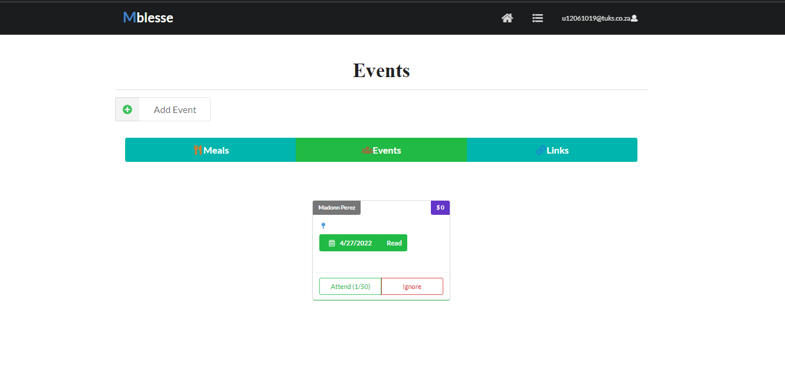
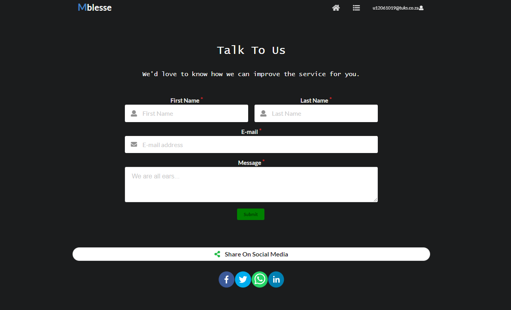

## Statement of Purpose

## Core Competency

#### MS Degree

<iframe width="100%" height="800" src="../pdfs/MSc_Computer_Science.pdf">

#### Qualifying Exam Results

<iframe width="100%" height="800" src="../pdfs/ICS_PhD_Qualifier_result_for_Moseli.pdf">

#### Resume

<iframe width="100%" height="800" src="../pdfs/Moseli_Motsoehli_Resume.pdf">

## Literature Review

## Publications

## Technical Reports
-----
